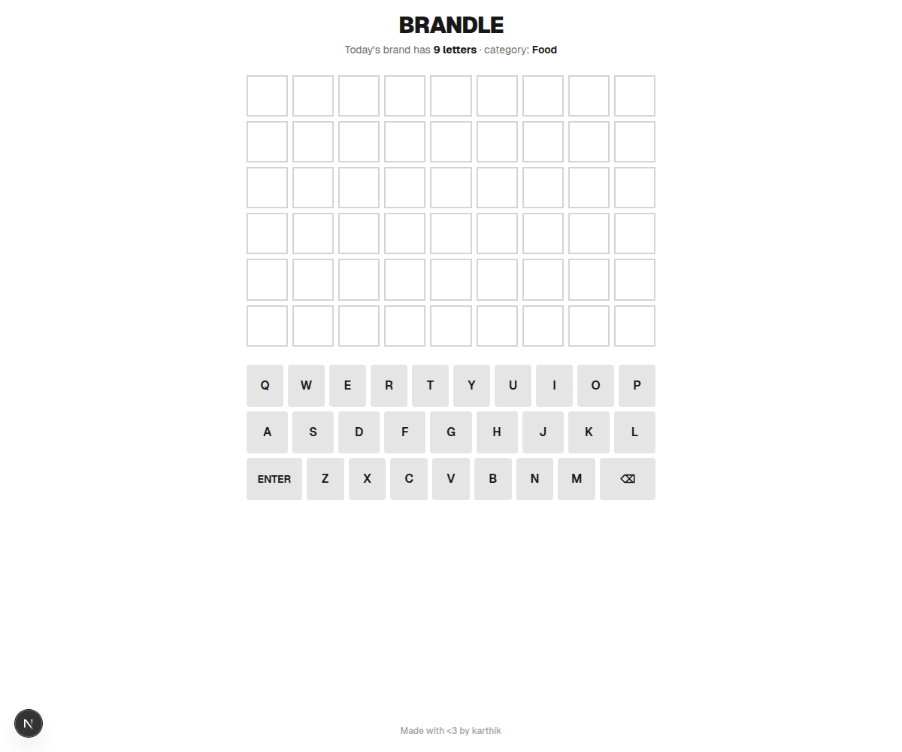

# Brandle

Brandle is a daily Wordle-style puzzle for brand names. Each day, the answer is
picked deterministically from a curated brand list, with the letter count and
category shown up front as hints.



## Features

- Daily puzzle keyed to the UTC date, so everyone gets the same brand each day.
- Variable-width board that adapts to the answer length.
- Six guesses with familiar Wordle feedback: correct spot, present letter, or absent.
- Alphabetic guesses only, with the answer drawn from the curated brand list.
- Local progress, stats, streaks, and guess distribution.
- Shareable result text with native share support and clipboard fallback.
- Practice mode after the daily puzzle, with no stats or saved progress.

## Tech Stack

- Next.js 16
- React 19
- Tailwind CSS 4
- TypeScript

## Run Locally

```bash
npm install
npm run dev
```

Open [http://localhost:3000](http://localhost:3000). If that port is already in
use, Next.js will print the alternate local URL.

## Project Structure

```text
app/
  components/     Game board, keyboard, stats, and tile UI
  lib/            Brand data, game logic, stats, and sharing helpers
  page.tsx        App shell and footer credit
public/
  screenshot.png  README preview image
```

## Game Logic

- `app/lib/brands.ts` stores the curated brand list.
- `app/lib/game.ts` selects the daily brand and evaluates guesses.
- `app/lib/stats.ts` stores daily progress and stats in `localStorage`.
- `app/lib/share.ts` builds the share string and handles sharing/copying.

## Scripts

```bash
npm run dev     # Start the local development server
npm run lint    # Run ESLint
npm run build   # Build for production
```

Made with <3 by karthik.
